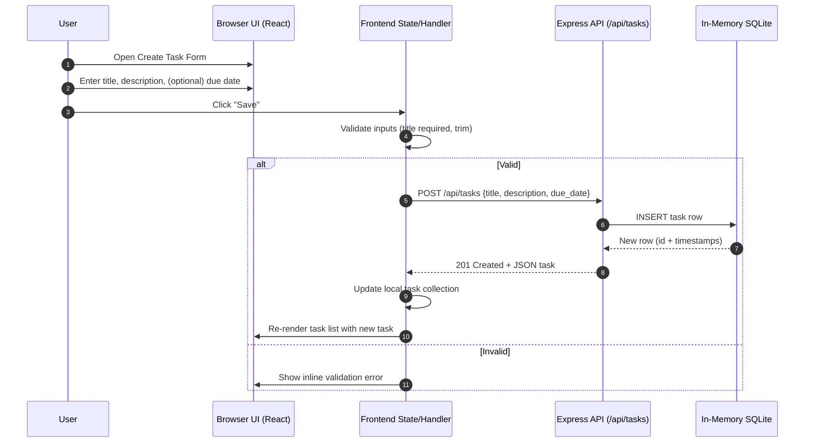
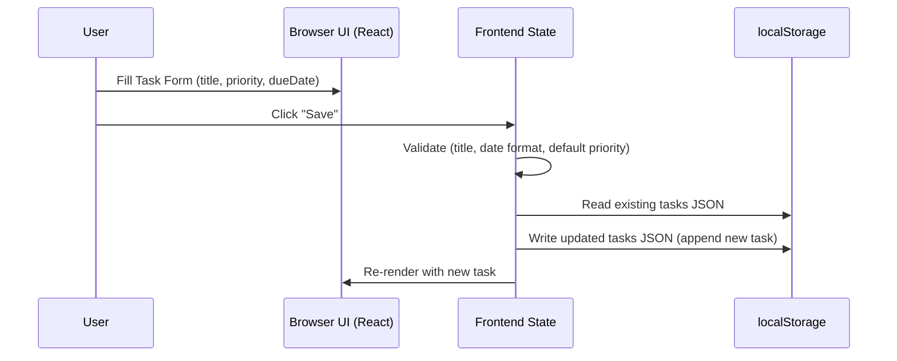

# Cloud / System Architecture Overview

This document provides a high-level architecture view of the TODO application monorepo and a sequence flow for creating a task. The current implementation includes a React frontend and an Express API backed by an in-memory SQLite database (`better-sqlite3`).

## System Context Diagram

The diagram shows principal actors and system boundaries. The frontend communicates with the backend REST API for task CRUD operations. Data is transient (in-memory DB) and resets on server restart.

```mermaid
graph TD
  A[User Browser] --> B[React Frontend (packages/frontend)]
  B -->|HTTP fetch /api/tasks| C[Express API (packages/backend)]
  C --> D[(In-Memory SQLite DB)]
  C -->|Logs| E[(Console / morgan)]
  subgraph External
    A
  end
  subgraph Monorepo
    B
    C
    D
  end
```

Key Notes:
- Frontend: Renders task list, forms, basic filtering (future enhancements: priority, due date, local-only persistence variant during MVP evolution).
- Backend: Provides REST endpoints for tasks (`GET, POST, PUT, PATCH, DELETE`).
- Database: In-memory SQLite loses state on process restart (suitable for development/demo).
- Logging: `morgan` outputs request logs to console.

---

## Planned Evolution

- Add priority and due date fields (frontend + possibly backend alignment) per PRD.
- Local-only persistence (frontend) for MVP of upgraded features while backend remains available for baseline tasks.
- Future: Sorting, highlighting, accessibility enhancements.

---

## Sequence: Creating a TODO Task

The following sequence illustrates a user creating a new task via the React UI, which submits to the Express API and receives a persisted representation from the in-memory database.



Notes:
- Validation currently performed front-end (title non-empty) and backend (title required) for defense-in-depth.
- In-memory DB persistence ends at server restart; future local-storage layer may coexist when MVP features added solely on frontend.
- Optional due date field stored as `due_date` column; absent values remain NULL.

---

## Future Variant: Local-Only Creation (MVP Upgrade)

For the MVP upgrade focusing on local-only persistence of new fields (priority, due date expansion), a parallel sequence (not implemented yet) would replace the POST request with direct write to `localStorage` and state, omitting backend interaction.



---

## Traceability

- System Context aligns with existing backend implementation (`packages/backend/src/app.js`).
- Sequence steps reflect route: `POST /api/tasks` creating row, then returning JSON.
- Future variant documents architectural divergence for MVP per PRD.

